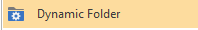
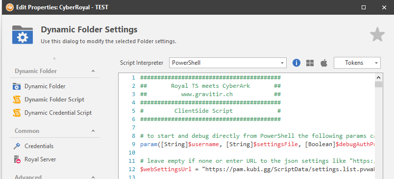
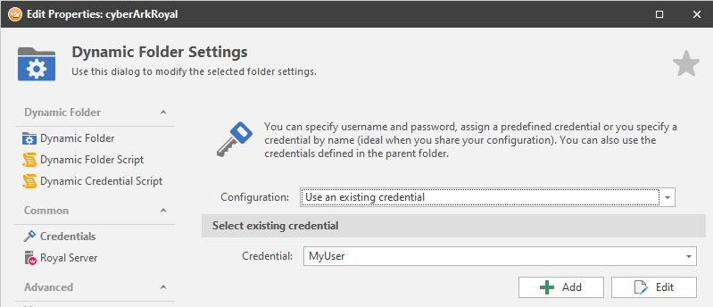
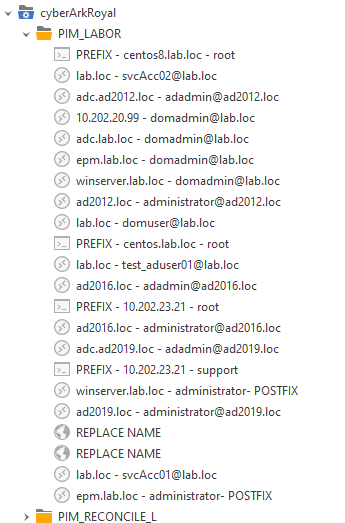
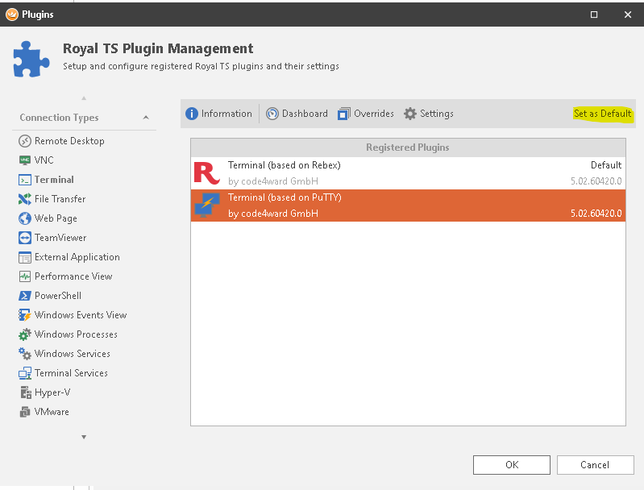
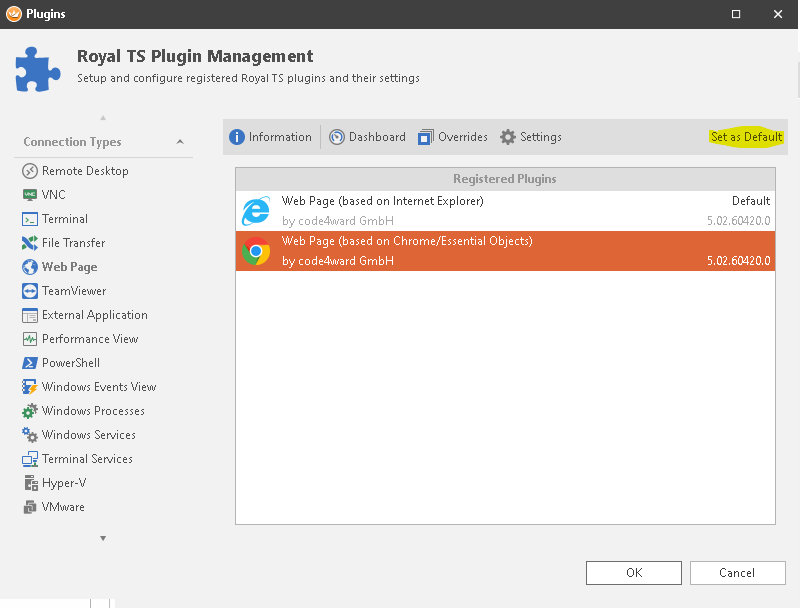
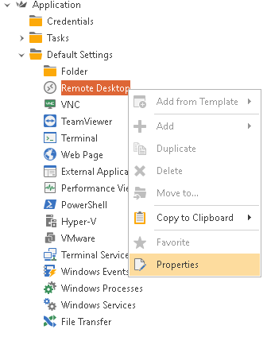
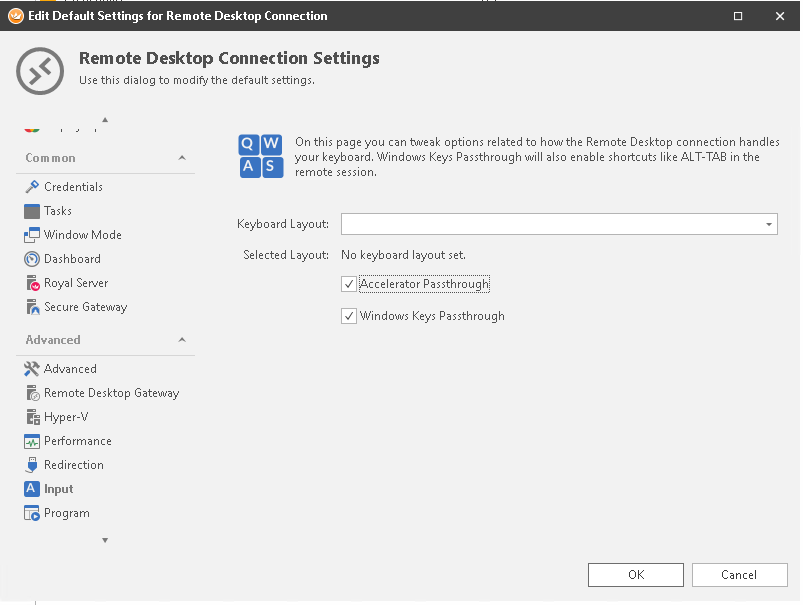

# cyberRoyal - RoyalTS Dynamic Folder for CyberArk PAS


- [cyberRoyal - RoyalTS Dynamic Folder for CyberArk PAS](#cyberroyal---royalts-dynamic-folder-for-cyberark-pas)
  - [Overview](#overview)
  - [Requirements](#requirements)
  - [ServerSide](#serverside)
    - [Place ServerSide script and define data folder](#place-serverside-script-and-define-data-folder)
    - [Configure audit user](#configure-audit-user)
    - [Setup ServerSide](#setup-serverside)
    - [ServerSide config.json parameters](#serverside-configjson-parameters)
    - [ServerSide logs](#serverside-logs)
  - [Setup ClientSide](#setup-clientside)
    - [RoyalTS Dynamic Folder](#royalts-dynamic-folder)
    - [ClientSide script switches](#clientside-script-switches)
    - [ClientSide script settings](#clientside-script-settings)
      - [Platform Mappings](#platform-mappings)
    - [Use permission list instead of Safes API Query](#use-permission-list-instead-of-safes-api-query)
    - [Use AD groups instead of Safes API Query](#use-ad-groups-instead-of-safes-api-query)
  - [RoyalTS recommended settings](#royalts-recommended-settings)
  - [References](#references)
  - [Interpreter](#interpreter)
  - [Known limitations](#known-limitations)

## Overview

RoyalTS integration with CyberArk PAS creates direct PSM for RDP and PSM for SSH connections in RoyalTS based permitted Accounts and Safes in CyberArk.
Connectionsa are created with a Dynamic Folder script in RoyalTS and uses either a prepared list (performant) or the PVWA API to retrieve permitted Accounts and Safes.

The implementation comes with a server and a client side script part.
ServerSide provides a powershell script for prefetched lists of safes and accounts, as well as permissions. This is helpful with a large amount of safes and accounts a user has access to might end into slow loading times via REST API.
ClientSide provides a powershell script for a "Dynamic Folder" in RoyalTS which creates all connection entries based on the safes and accounts the client user has access to.

## Requirements

- CyberArk PAS v10.x or greater
- PowerShell v3 or greater (PWSH 7 is supported)
- RoyalTS v5.0 or greater (v5.1+ with Web AutoForm Login entries)
- CyberArk PSM for RDP which allows to connect RDP directly (with or without NLA) - see [CyberArk PSM documentation](https://docs.cyberark.com/Product-Doc/OnlineHelp/PAS/Latest/en/Content/PASIMP/PSSO-ConnectingDirectly.htm)
- A webserver that can provide the server side prefetched list (e.g. use an IIS from a PVWA component server)
- Domain accounts in CyberArk must provide their targets in the "RemoteMachineAddress" attribute

## ServerSide

The Server Side part generates a list of safes and accounts and is optional to use.
Because the WebAPI call to list all accounts in all your accessable safes can take its time, it will be much faster to use a pre-fetched list.
This gives an overall better user experience.

### Place ServerSide script and define data folder

Place the ServerSide PowerhSell script cyberarkSafeAccountList.ps1 with the "log" folder somewhere like **C:\Scripts** and define a data folder to write the safeaccountlist to like **C:\CyberArk\ScriptData**

### Configure audit user

Define an audit user or take the builtin cyberark "Auditor"
Put the user password into a key encrypted PowerShell secure string file. The key makes it possible to decrypt this secure string also within a scheduled Task and the executing user.

It could be a good practice to use AAM Credential Provider to retreive the audit user password instead of define a secure string file.

### Setup ServerSide

Use the [setup](/serverSide/setup.ps1) script to setup the scripts with the auditor user credentials and settings.json file

### ServerSide config.json parameters

Via  [setup](/serverSide/setup.ps1) the ServerSide Configuration is saved in a config.json file.

| Parameter                           | Values                       | Description                                                                                                                                 |
| ----------------------------------- | ---------------------------- | ------------------------------------------------------------------------------------------------------------------------------------------- |
| pvwaUrl                             | "https://PVWA/PasswordVault" | Base URL of the PVWA where the script will use the API to retrieve all safes and accounts                                                   |
| scriptPath                          | "c:\path\"                   | Full path where the scripts will be                                                                                                         |
| listPath                            | "c:\path\file.json"          | Full path where the safes and accounts list JSON will be stored                                                                             |
| apiUsername                         | "Auditor"                    | CyberArk (internal) API user with auditor permissions or read/list permissions to all required safes and accounts to generate the list from |
| apiPasswordFile                     | "C:\scripts\secret.ini"      | Secure String password file                                                                                                                 |
| apiPasswordKey                      | "C:\scripts\keys\secret.key" | Secure String key file to decrypt the password file                                                                                         |
| debugOn                             | boolean $true or $false      | Provides console output if scripts executed in console and writes more details in logfile and event logs                                    |
| psCertValidation                    | boolean $true or $false      | Enable/Disable SSL/TLS certificate validation callback in PowerShell (.NET) - disable this is self-signed certs are use                     |
| additionalPlatformAccountProperties | string Array                 | List of "PlatformAccountProperties" to additionally fetch and provide in the SafeAndAccountsList                                            |

### ServerSide logs

The script with the Log-Module provides some log information in the same scriptfolder where it is executed with %scriptName%.log and Event-Logs under 'Windows Logs\Windows PowerShell'

## Setup ClientSide

Prepare the ClientSide script with the necessary paramaters, see [client switches](#ClientSide-script-switches) and [client settings](#ClientSide-script-settings)

### RoyalTS Dynamic Folder

To use the script in RoyalTS, create a new dynamic folder:



Set the Dynamic Folder Script Interpreter to  **PowerShell** and paste in the ClientSide script



Setup a Credential object for your CyberArk PVWA User in RoyalTS and use it as Credentials in the Dynamic Folder so the script will be able to login on to the PVWA API (not in _groupBasedMode_ or _allAccountsMode_)
CyberRoyal will prompt for the credentials or password if username or password is not defined and required for the PVWA authentication.



Once applied, the Dynamic Folder Script will be executed when **Reloading** the Dynamic Folder


Based on the mode, platform mapping, access permissions and other settings the script should create connection entries in the Dynamic Folder:



### ClientSide script switches

Switches on the script to run in different modes

| Parameter        | Values                                 | Description                                                                                                                                                                |
| ---------------- | -------------------------------------- | -------------------------------------------------------------------------------------------------------------------------------------------------------------------------- |
| webSettingsUrl   | "https://WebServer/Data/settings.json" | Will take all settings for the client side script from a central stored JSON instead of locally defined in the PS script. Leave empty to take the locally defined settings |
| psCertValidation | boolean $true or $false                | Enable/Disable SSL/TLS certificate validation callback in PowerShell (.NET) - disable this is self-signed certs are use                                                    |

### ClientSide script settings

Script settings in JSON format which can be defined within the script or taken from a URL. See also the sample settings in [examples](/examples/clientSide/)
We use booleans in the JSON config as 0 and 1 because there is an issue with RoyalTS DynamicFolder that, when inserting the scrip, somtimes replaces true/false in lowercase with TRUE/FALSE big upper-case characters - this leads to script execution errors.

```json
{
    "cyberRoyalMode": "list",

    "listMode": "listALL",
    "listUrl": "https://YOUR-WEBHOST/ScriptData/cyberRoyalSafeAccountList.json",
    "listPermissionUrl": "https://YOUR-WEBHOST/ScriptData/cyberRoyalPermissionList.json",
    "listAdGroupSafeRegex": "CN=.*?(SafeName),OU=.*",

    "pvwaUrl": "https://YOUR-PVWA/PasswordVault",
    "pvwaAuthMethod": "LDAP",
    "usernameFromEnv": 0,

    "pvwaSafeSearch": "",
    "pvwaSavedFilter": "Favorites",
    "pvwaAdditionalProperties": [ "location", "FQDN" ],

    "psmRdpAddress": "YOUR-PSM",
    "psmSshAddress": "YOUR-PSMP",

    "safeFilter": ".*",
    "excludeAccounts": [ "guest", "player" ],
    "excludeEmptyFolders": 1,

    "connectionNaming": "target|simple|named",
    "connectionDescription": "location",

    "folderCreation": "safeName",
    "folderAccountParameter": "Location",

    "enableNLA": 0,

    "rdpResizeMode": "SmartSizing",
    "useWebPluginWin": "f008c2f0-5fb3-4c5e-a8eb-8072c1183088",
    "platformMappings": {
        "UnixSSH": {
            "connections": [ {
                "type": "SSH",
                "components": ["PSMP-SSH"]
            },
            {
                "type": "SFTP",
                "components": ["PSMP-SFTP"]
            },
            {
                "type": "RDP",
                "components": ["PSM-WinSCP"]
            }
            ]
        },
        "WinDomain": {
            "psmRemoteMachine": 1,
            "drivesRedirection": 1,
            "connections": [ {
                "type": "RDP",
                "components": ["PSM-RDP"]
            }]
        },
        "WinServerLocal": {
            "namePrefix": "Local - ",
            "namePostfix": "",
            "psmRemoteMachine": 0,
            "color":  "#FF0000",
            "connections": [ {
                "type": "RDP",
                "components": ["PSM-RDP"]
            }]
        }
    }
}
```

| Parameter                | Values                                                                                            | Description                                                                                                                                                                                                                                                                                                                                                              |
| ------------------------ | ------------------------------------------------------------------------------------------------- | ------------------------------------------------------------------------------------------------------------------------------------------------------------------------------------------------------------------------------------------------------------------------------------------------------------------------------------------------------------------------ |
| cyberRoyalMode           | list, pvwa                                                                                        | list: gets prefetched lists for accounts and safes and RBAC permissions as well which requires a serverSide or webserver that provides these lists. pvwa: gets accounts, safes and users permission via PVWA API and does not need any serverSide with prefetched lists.                                                                                                 |
| listMode                 | adGroupRBAC, pvwaRBAC, listRBAC, listALL                                                          | adGroupRBAC: gets safe permission from AD direct via defined group-safename mapping. pvwaRBAC: gets safe permissions from PVWA API directly. listRBAC: gets safe permission via a RBAC list of safes (e.g. prepare list from an LDAP query) for the current user. listALL: creates entries for all safe and accounts.                                                    |
| pvwaUrl                  | "https://PVWA/PasswordVault"                                                                      | PVWA URL used for the API login with the executing user (not relevant in listModes without PVWA)                                                                                                                                                                                                                                                                         |
| listUrl                  | "https://WebServer/ScriptData/cyberRoyalSafeAccountList.json"                                     | URL where the safes accounts list JSON file can be retrieved                                                                                                                                                                                                                                                                                                             |
| listPermissionUrl        | "https://WebServer/ScriptData/cyberRoyalPermissionList.json"                                      | URL where the RBAC permission list JSON for user and safes can be retrieved                                                                                                                                                                                                                                                                                              |
| listAdGroupSafeRegex     | "CN=.*?(SafeName),OU=.*"                                                                          | required for listMode "adGroupRBAC" - regex for mapping AD Groups where match group 1 matches safenames                                                                                                                                                                                                                                                                  |
| pvwaAuthMethod           | LDAP/RADIUS/CyberArk                                                                              | Defines the API authentication Method for the user to authenticate against the PVWA (not relevant in groupBasedMode or allAccountsMode)                                                                                                                                                                                                                                  |
| pvwaSafeSearch           | Safe XY                                                                                           | Will only get accounts from the PVWA API Safe search ("like search")                                                                                                                                                                                                                                                                                                     |
| pvwaSavedFilter          | Favorites, Recent                                                                                 | Will only fetch accounts from PVWA  saved filter list                                                                                                                                                                                                                                                                                                                    |
| pvwaAdditionalProperties | string array, @("location", "FQDN")                                                               | Fetch additional platform account properties from PVWA accounts and safes to use for connection description etc.                                                                                                                                                                                                                                                         |
| psmRdpAddress            | "psm.domain.local"                                                                                | PSM for RDP Server address FQDN/IP to take for the created RDP connection entries                                                                                                                                                                                                                                                                                        |
| psmSshAddress            | "psmp.domain.local"                                                                               | PSM for SSH Server address FQDN/IP to take for the created SSH connection entries                                                                                                                                                                                                                                                                                        |
| safeFilter               | string (RegEx in PS)                                                                              | Regular Expression to match a safe name. A regex like _".\*domain.\*"_  will match e.g. a safe with name "WinDomainAccounts"                                                                                                                                                                                                                                             |
| listAdGroupSafeRegex     | string (RegEx in PS)                                                                              | Regular Expression to match a safe name as the first match group. A regex like _"CN=.\*-(.+-WinDomain.+)-Users,OU=.\*"_ will match e.g. a safe with name "T0-WinDomainAccounts" from a group DN like _"CN=rolePrefix-T0-WinDomainAccounts-Users,OU=pam,DC=domain,DC=loc"_                                                                                                |
| useWebPluginWin          | "", "f008c2f0-5fb3-4c5e-a8eb-8072c1183088"                                                        | If not empty then this RoyalTS Windows Plugin ID will be taken as "Browser Engine" for Web connection entries. Also possible to just use Default Settings in RoyalTS                                                                                                                                                                                                     |
| connectionNaming         | string                                                                                            | choose between target (Target address only), simple (account@target) or named (account@address - target)                                                                                                                                                                                                                                                                 |
| connectionDescription    | safe, additional property                                                                         | will set the RoyalTS connection entry description based on this property. Default is safename                                                                                                                                                                                                                                                                            |
| folderCreation           | safeName, safeDescription, safeName-Description, safeDescription-Name, platform, accountParameter | Will creates folder for all connection entries based on the provided naming scheme: **none** will create no folders, **safe.name** will create folder based on the safe name the accounts are in, **safe.description** from the safe description, **safe.name-description** from safe name + description and **safe.description-name** from safe description + safe name |
| enableNLA                | ScrollBars, SmartResize (default)                                                                 | Sets the resize mode for RDP connection in RoyalTS (RyoalTS v6 default will do a Reconnect)                                                                                                                                                                                                                                                                              |
| rdpResizeMode            | "SmartSizing"(false)                                                                              | RoyalTS RDP Resize mode                                                                                                                                                                                                                                                                                                                                                  |
| rdpAuthenticationLevel   | "0" (false)                                                                                       | RoyalTS RDP Network Authentication Level  AuthenticationLevel as 0 = Connect And Do Not Warn Me, 1 = Do Not Connect, 2 = Warn Me                                                                                                                                                                                                                                         |
| excludeAccounts          | string array["user1","user2"]                                                                     | Excludes these accounts / usernames from creating any connection entries                                                                                                                                                                                                                                                                                                 |
| excludeEmptyFolders      | boolean 0 or 1                                                                                    | If folder are created fo the RoyalTS connections but they would be empty as of no connection mappings, then they will not be created                                                                                                                                                                                                                                     |
> In some specific RoyalTS versions there is an issue with "true" und "false" value, where RoyalTS did rewrite these keywords in capital letters. This becomes an invalid type in JSON format. As a workaround you can also use 0 (false) or 1 (true) instead of the keywords in our json settings

#### Platform Mappings

Platform Mapping is required to match certain CyberArk Platform for accounts to a specific connection entry in RoyalTS.
As platforms can be rather different and customized, the platformMappings provides the necessary parameters to create connections properly.
The platformMappings entry is a dictionary of Platform-ID as unique Key and a Dictionary of parameters as Values

| Parameter         | Values                                               | Description                                                                                                                                                                                                                                                                                                                                                                                            |
| ----------------- | ---------------------------------------------------- | ------------------------------------------------------------------------------------------------------------------------------------------------------------------------------------------------------------------------------------------------------------------------------------------------------------------------------------------------------------------------------------------------------ |
| connections       | Array of connection entries with type and components | connection entry like {"type":"RDP", components:["PSM-RDP","PSM-MMC"]} where "type" can be SSH, SFTP, RDP, WEB and component should match to a CyberArk connection component for the corresponding platform. Therefore it is possible to create multiple connection with the same account for different connection components like a Firewall account to create a connection via RDP Web but also SSH. |
| accountType       | local, domain                                        | Defines if an account is local "username -> address" oder domain with "username@logonDomain -> RemoteMachineAdress as target" in the connection entry "psm /a and /t parameter"                                                                                                                                                                                                                        |
| replacePsm        | string                                               | Replaces the connection computername / PSM RDP address for connections created from this specific platform with the specified value                                                                                                                                                                                                                                                                    |
| replacePsmp       | string                                               | Replaces the connection computername / PSMP SSH address for connections created from this specific platform with the specified entries                                                                                                                                                                                                                                                                 |
| connectionNaming  | string                                               | choose between target (Target address only), simple (account@target) or named (account@address - target)                                                                                                                                                                                                                                                                                               |
| replaceName       | string                                               | Replaces the connection entry name entirely with this value                                                                                                                                                                                                                                                                                                                                            |
| replaceRegex      | string                                               | Replaces the connection entry name with this RegEx that matches. Good to filter out FQDN in server names e.g. Regex: "@domain.acme.com"                                                                                                                                                                                                                                                                |
| namePrefix        | string                                               | Prefix in the connection entry name                                                                                                                                                                                                                                                                                                                                                                    |
| namePostfix       | string                                               | Postfix in the connection entry name                                                                                                                                                                                                                                                                                                                                                                   |
| psmRemoteMachine  | boolean                                              | Consideres PSM Remote Machines and create multiple entries per Remote Machine                                                                                                                                                                                                                                                                                                                          |
| drivesRedirection | boolean                                              | Enables the Drives Redirection in the RDP Settings of the entry                                                                                                                                                                                                                                                                                                                                        |
| color             | string                                               | Sets an hexadecimal color (e.g. #FF0000 for red) for this entries                                                                                                                                                                                                                                                                                                                                      |
| webProtocol       | https/https                                          | only used in PSM for Web connection entries as target address protocol to use. Target address are mostly only an IP or FQDN                                                                                                                                                                                                                                                                            |
| webOverwriteUri   | URI as string                                        | only used in PSM for Web connection entries as target URI (like: acme.com/xyc) - The URL is combined with the webProtocol + webOverwriteUri. If not defined or empty, URI is taken from the account address.                                                                                                                                                                                           |
| webInputObject    | string                                               | used as Input Form object where the conneciont entry will fill in "yourUsername:accountUsername" for the PSM for Web Proxy process                                                                                                                                                                                                                                                                     |

Example of a platform mapping. See also [settings.json](/examples/clientSide/settings.json)

```powershell
    "platformMappings": {
        "UnixSSH": {
            "connections": [{ "type": "SSH", "components": ["PSMP-SSH"] }]
        },
        "LinuxLinux": {
            "replacePsmp": "ANOTHER-PSMP-ADDRESS",
            "connections": [
                { "type": "SSH", "components": ["PSMP-SSH"] },
                { "type": "SFTP", "components": ["PSMP-SFTP"] }
            ]
        },
        "CyberCyberNix": {
            "replacePsm": "ANOTHER-PSM-ADDRESS",
            "replacePsmp": "ANOTHER-PSMP-ADDRESS",
            "connections": [
                { "type": "SSH", "components": ["PSMP-SSH"] },
                { "type": "RDP", "components": ["PSM-Winscp"] }
            ]
        },
        "WindowsDomain": {
            "psmRemoteMachine": 1,
            "connections": [{
                    "type": "RDP",
                    "components": ["PSM-RDP", "PSM-RDP-Console", "PSM-DSA"]
                },
                { "type": "SSH", "components": ["PSMP-BadExample"] }
            ]
        },
        "ExchangeDomainUser": {
            "replacePsm": "ANOTHER-PSM-ADDRESS",
            "connections": [
                { "type": "RDP", "components": ["PSM-RDP", "PSM-WebECP"] }
            ]
        },
        "Fortigate": {
            "replaceName": "AldiFW",
            "color": "#FF0000",
            "connections": [
                { "type": "RDP", "components": ["PSM-FortiWeb"] },
                { "type": "SSH", "components": ["PSMP-SSH"] }
            ]
        },
        "WindowsServerLocal": {
            "replaceRegex": "@domain.acme.com",
            "namePrefix": "Local - ",
            "namePostfix": " - Conn",
            "psmRemoteMachine": 0,
            "drivesRedirection": 1,
            "connectionNaming": "target",
            "connections": [{ "type": "RDP", "components": ["PSM-RDP"] }]
        },
        "AzureWebAccount": {
            "namePrefix": "Azure - ",
            "webProtocol": "https",
            "webOverwriteUri": "",
            "webInputObject": "input#i0116",
            "connections": [{ "type": "WEB", "components": ["AzureWebsite"] }]
        }
    }
```
### Use permission list instead of Safes API Query

With listMode _listRBAC_ a permission list can be used to determine the safes for the current user which creates only connection entries where a use permission is available. The simple list lead only username and its available SafeNames as permission array. See an example of the predefined JSON permisison list: [permissionList.json](/examples/serverSide/cyberRoyalPermissionList.json)

### Use AD groups instead of Safes API Query

With the listMode  _adGroupRBAC_ it is possible to use AD groups instead of PVWA access permissions to find out which safes and accounts the user has access to.
The script takes the $env:username from the domain joined windows client where RoyalTS is running and fetched all group memberships of this user from AD.
Groups DN's are compared with the _listAdGroupSafeRegex_ and if a Group DN matches the first regex match group (1) should match exactly with a safe name in CyberArk.

An expression like

```powershell
$groupBasedSafeRegex = "CN=.*?CyberArk-(.*)-[M|U],OU=.*"
```

would match a group DN like: **CN=RolegroupsXY-CyberArk-T1_TestApp-M,OU=PAM,OU=Groups,DC=LAB,DC=LOC**
And the first match group results as: **T1_TestApp**
If there is a safe with name **T1_TestApp** then the script will create connection entries based on match

## RoyalTS recommended settings

Use Putty as Default SSH Plugin is recommended



Use Chrome as Default Web Engine Plugin is recommended



Change Default settings for each created connection in a Dynamic Folder with the **Default Settings** for Applications:



RDP Settings like Key Passthrough (fetch key combinations e.g. ALT+TAB in the RDP session) will be set on the RDP connection entries based on this default settings



## References

RoyalTS JSON Format and properties: <https://content.royalapplications.com/Help/RoyalTS/V5/index.html?scripting_objectproperties_royalrdsconnection.htm>

RoyalTS rJSON objects: <https://docs.royalapps.com/r2021/scripting/rjson/available-properties/royaljsonobject.html>

## Interpreter

Use PowerShell as the Script Interpreter either by default
```
%SystemRoot%\system32\WindowsPowerShell\v1.0\powershell.exe
```

Or use PowerShell 7 PWSH by setting the Script Interpreter path to the installation location of PWSH 7:
```
C:\Program Files\PowerShell\7\pwsh.exe
```

## Known limitations

- SAML auth method for PVWA will not work, apply a list based mode (PowerShell SAML auth might come in the future)
- Multiple and different connection entries for different connection components in the same Platform cannot be used actually
- OLAC will not be differentiated from safe ACL to create accessable connections
